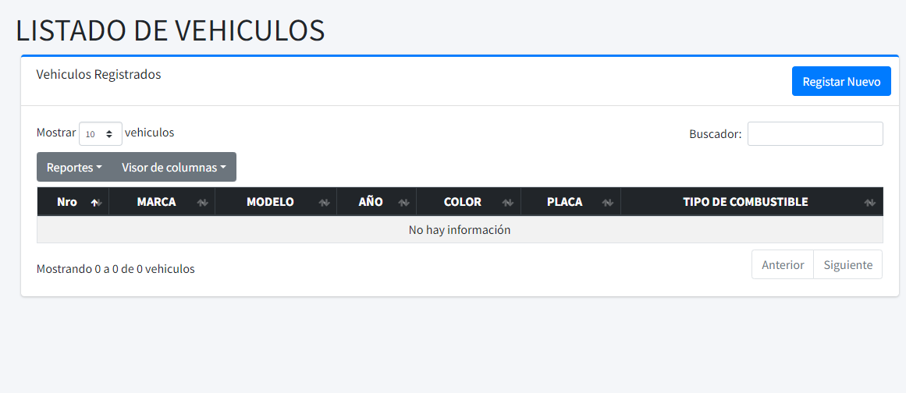

# PROYECTO SISTEMA DE RESERVA DE CITAS

Este repositorio contiene un proyecto basado en Laravel v. 10 que consiste en poder realizar reservas mediante un calendario para el usuario y registrarlo en el sistema. A continuación, se detallan las características clave incluidas en este proyecto.

 
## Tecnologías Usadas
  

 


 

   


## Requisitos

- **PHP**: ^8.1
- **Composer**: Herramienta de gestión de dependencias

## Instalación

1. Clona el repositorio:
   ```bash
   git clone  https://github.com/FerlRoque20/sisreservadecitas
   cd sisreservadecitas
   ```

2. Instala las dependencias:
   ```bash
   composer install
   ```

3. Configura el entorno copiando  y cambiándole el nombre a .env:
   ```bash
   cp .env.example .env
   php artisan key:generate
   ```

4. Configura el archivo `.env` con los ajustes de tu base de datos y aplicación.
    ```bash
   SESSION_DRIVER=file
   ```
      `DB_CONNECTION=mysql`
   `DB_HOST=127.0.0.1`
   `DB_PORT=3306`
   `DB_DATABASE=reserva`
   `DB_USERNAME=root`
   `DB_PASSWORD=12345678`   


5. Ejecuta las migraciones y seeders:
   ```bash
   php artisan migrate --seed
   ```

6. Inicia el servidor o utiliza [Laravel HERD](https://herd.laravel.com/windows "Laravel HERD"):
   ```bash
   php artisan serve
   ```
7. Ingresa a  localhost:8000 o en el caso de laravel herd - http://sisreservadecitas.test
8. Ingresa a la parte administrativa añadiendo el /login. y accede medienate las credenciales.
  
   ```bash
   user: administrador@gmail.com
   password: 123456789
   ```
 9. Puedes registrar nuevos usuarios en la ruta /register
 
  
## Capturas del proyecto
### Reserva de Citas
  
   
### Dashboard - /admin
   
### Usuarios - admin/usuarios
   
### Secretarios - admin/secretarias
 
 ### Clientes - admin/clientes
  
  ### Areas - admin/areas
  
   ### Vehículos - admin/vehiculos
   
    ### Encargados - admin/encargados
 
   ### Horarios - admin/horarios
   
### Paquetes incluidos

#### Dependencias de producción
- **[barryvdh/laravel-dompdf](https://github.com/barryvdh/laravel-dompdf)**: Generación sencilla de PDFs.
- **[guzzlehttp/guzzle](https://github.com/guzzle/guzzle)**: Cliente HTTP para solicitudes API.
- **[laravel/sanctum](https://laravel.com/docs/10.x/sanctum)**: Autenticación API segura basada en tokens.
- **[laravel/ui](https://github.com/laravel/ui)**: Interfaces preconstruidas para autenticación.
- **[spatie/laravel-permission](https://spatie.be/docs/laravel-permission/v6)**: Gestión de roles y permisos.

#### Dependencias de desarrollo
- **[fakerphp/faker](https://fakerphp.github.io)**: Generador de datos falsos para pruebas.
- **[laravel/pint](https://github.com/laravel/pint)**: Corrector de estilo de código específico de Laravel.
- **[laravel/sail](https://laravel.com/docs/10.x/sail)**: Entorno de desarrollo local basado en Docker.
- **[mockery/mockery](https://github.com/mockery/mockery)**: Biblioteca de mock para pruebas unitarias.
- **[phpunit/phpunit](https://phpunit.de)**: Marco de pruebas unitarias.
- **[spatie/laravel-ignition](https://spatie.be/docs/laravel-ignition)**: Depuración e informes de errores.
- **[nunomaduro/collision](https://github.com/nunomaduro/collision)**: Mejor reporte de errores en CLI.

## Funcionalidades de Laravel

- **Ruteo**: Define rutas limpias y RESTful.
- **Middleware**: Agrega lógica personalizada a las solicitudes HTTP de tal forma que aquí aplicaremos las restricciones para que solo usuarios uqe hayan ingresado puedan realizar peticiones como Insert,Delete, Update.
- **Blade Templating**: Componentes dinámicos y reutilizables de HTML.
- **Eloquent ORM**: Gestiona operaciones de bases de datos eficientemente.


## Estructura del proyecto

- `app/` - Lógica de la aplicación
- `database/` - Factories, migraciones y seeders
- `public/` - Punto de entrada del servidor web
- `resources/` - Vistas, CSS y activos JavaScript
- `routes/` - Definiciones de rutas
- `tests/` - Pruebas unitarias y funcionales

## Scripts

- **Comandos post-instalación**:
  - Generar clave de la aplicación: `php artisan key:generate`
  - Publicar activos: `php artisan vendor:publish --tag=laravel-assets`

## Contribuciones

¡Contribuciones son bienvenidas! Siéntete libre de bifurcar el repositorio y enviar una solicitud de extracción.

## Licencia

Este proyecto es de código abierto bajo la [licencia MIT](https://opensource.org/licenses/MIT).

## Recursos adicionales

- [Documentación de Laravel](https://laravel.com/docs/10.x)
- [Documentación de Composer](https://getcomposer.org/doc/)